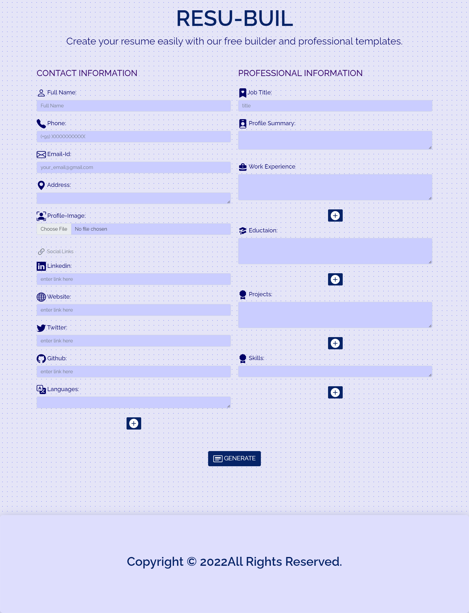

<h1>Resume Builder</h1>

### Free and open source, fully customizable professional single page resume builder

&nbsp;&nbsp;&nbsp;&nbsp;&nbsp;&nbsp;&nbsp;&nbsp;&nbsp;&nbsp;

👉 &nbsp;&nbsp;[Single Page Resume Builder](https://sandhya312.github.io/RESU-BUIL/)&nbsp;&nbsp;👈

### For users

- Replace all the placeholder with you information
- Click on Print and save as PDF. 
- If you want to change anything then go back and change it.
### For developers

- `git clone https://github.com/Sandhya312/RESU-BUIL.git`

### Technologies

- HTML
- CSS & BOOTSTRAP
- JAVASCRIPT
- [HTML2PDF.JS](https://www.npmjs.com/package/html2pdf.js/v/0.9.0) 

More features coming soon

---
